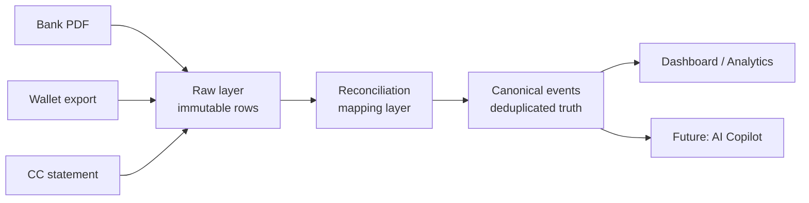

# Finsight

> Personal financial intelligence platform that ingests bank statements and reconciles transactions across sources into a single canonical ledger.

**Live demo:** [finsight-production-db99.up.railway.app](https://finsight-production-db99.up.railway.app/)
**Repo:** [github.com/Loki1928/Finsight](https://github.com/Loki1928/Finsight)


---

## What V1 does

- Parses real HDFC bank statement PDFs (password-protected supported) into structured rows.
- Verifies parser correctness to the paisa against the bank's own statement summary.
- Materializes a canonical event for every transaction via a 3-layer pipeline (raw → reconciliation → canonical).
- Categorizes transactions using a merchant-normalization pipeline with editable rules.
- Displays a dashboard with total spend, spend by category, and a verification view of all parsed rows.

V1 was tested on a real HDFC April 2026 statement: 97 rows, 73 debits, 24 credits, totals matching the bank summary exactly (₹2,75,218.59 debit / ₹2,82,778.00 credit / net +₹7,559.41).

---

## Why the 3-layer architecture

Personal finance data in India lives across at least 5 sources for most people: bank statements, credit card statements, UPI apps (GPay/PhonePe), wallets (Paytm/MobiKwik), and cash. The same real-world payment frequently shows up in multiple sources at once — and naive aggregation double-counts it.

A real example from the test data:

- A friend sends ₹500 via UPI → arrives in HDFC as a credit.
- The user pays ₹500 to someone else through MobiKwik. MobiKwik has ₹2 of accumulated cashback in the wallet, so it pulls ₹498 from HDFC and tops up ₹2 from the wallet.
- HDFC's statement shows one ₹498 debit. MobiKwik's statement shows one ₹500 send.
- Naive aggregation: ₹998 of outflow. Reality: ₹500.

The architecture is built to solve this:



**Raw layer** — every parsed row is preserved verbatim. Never edited, never deleted. Re-running reconciliation logic never destroys source data.

**Reconciliation mapping layer** — connects raw rows that represent the same real-world event. One canonical event can have many raw rows. One raw row maps to exactly one canonical event.

**Canonical layer** — the deduplicated, authoritative view. All analytics, dashboards, and future AI queries read from here. Carries a `confidence_score`, `reconciliation_level`, and `reconciliation_evidence` JSON so every merge is auditable.

The schema was designed up front to support reconciliation. V1 only ingests one source (HDFC) so reconciliation runs as a 1:1 pass, but adding wallet parsers in V1.x will exercise the engine without rewriting any of V1.

---

## Another design decision: credit card bill payments

When a user pays their CRED bill (e.g. ₹40,000 to settle a credit card outstanding), naive aggregation counts it twice: once as a ₹40,000 bank debit *and* again as the sum of all the underlying card transactions that month. That inflates spend by 100%.

The canonical event schema carries an `is_liability_payment` flag. CRED-style settlement events get tagged and excluded from spend totals — only the underlying card transactions count as real spend. V1 currently categorizes these as `Bill Payment (CRED)` so they show in lists; the exclusion logic ships in V1.x along with a user-confirmation UX.

---

## Tech stack

| Layer | Choice | Why |
|---|---|---|
| Backend | FastAPI (Python 3.12) | Async, auto OpenAPI docs, Pydantic validation. |
| Database | SQLite + SQLAlchemy 2.x | Single-file, local-first, fast enough for personal finance. WAL mode enabled. |
| Frontend | Server-rendered Jinja2 + Tailwind CDN | No build step, no Node toolchain. Ships fast, stays maintainable. |
| PDF parsing | pdfplumber + pikepdf | Text extraction for narration-heavy bank PDFs; pikepdf handles password-protected files. |
| Fuzzy matching | rapidfuzz | Used for merchant normalization; will power Level 2/3 reconciliation in V1.x. |
| Deployment | Docker on Railway | One Dockerfile, auto-deploy on push to main. |

---

## Architecture highlights

- **Parser correctness gate**: the HDFC parser must reconcile to the statement summary within 1 paisa or the upload fails verification. This was the gate that closed Phase 1.
- **Page-boundary handling**: HDFC PDFs leak page-footer text into transaction narrations across page boundaries. The parser uses a `STOP_KEYWORDS` list and a footer-zone flag reset at the top of each page.
- **Merchant normalization**: regex-based pattern matching against a curated table reduces the long tail of UPI narration strings (`UPI-PRAMODAR SHRIYAN-SHRIYAN10@IBL-SBIN0000945-...`) into a clean merchant name for categorization and future reconciliation.
- **Immutable raw layer**: `raw_transactions` rows are never mutated. Reconciliation logic can be re-run from scratch without re-uploading any statements.

---

## What's in V1 vs designed-for-V1.x

V1 ships:

- HDFC bank statement PDF parser
- Password-protected PDF support
- Raw → canonical materialization (1:1 pass for now)
- Merchant normalization + rule-based categorization
- Verification view + basic dashboard
- Live deployment on Railway

V1.x designed-for but not shipped:

- MobiKwik wallet parser
- Level 1 reconciliation (exact reference-ID match across sources)
- Level 2 reconciliation (narration-route matching + amount tolerance)
- `is_liability_payment` flag enforcement on dashboard totals
- Authentication + persistent volume on Railway

V2:

- Additional bank parsers (SBI, ICICI, Kotak, Axis, IDFC, AU)
- Additional wallet parsers (GPay, PhonePe, Amazon Pay)
- AI copilot (function-calling architecture, narrate-only)
- Goal tracker, budget engine, recurring transaction detection
- Manual investment tracking + full net worth calculation

---

## Local development

```bash
# Clone
git clone https://github.com/Loki1928/Finsight.git
cd Finsight

# Python 3.12+
pip install -r requirements.txt

# Run
uvicorn app.main:app --reload --host 0.0.0.0 --port 8000
```

App is live on `http://localhost:8000`. The SQLite database is created automatically on first startup.

---

## Privacy

- The live demo URL has **no persistent storage** by design. The database wipes on every redeploy. The live URL is for evaluation only, not for real ongoing finance tracking.
- PDF passwords are sent once with the upload, used to decrypt in-memory, and never logged or persisted.
- The repo never contains real statement files. Test fixtures live outside the repo.

---

## License

MIT — see [LICENSE](./LICENSE).

