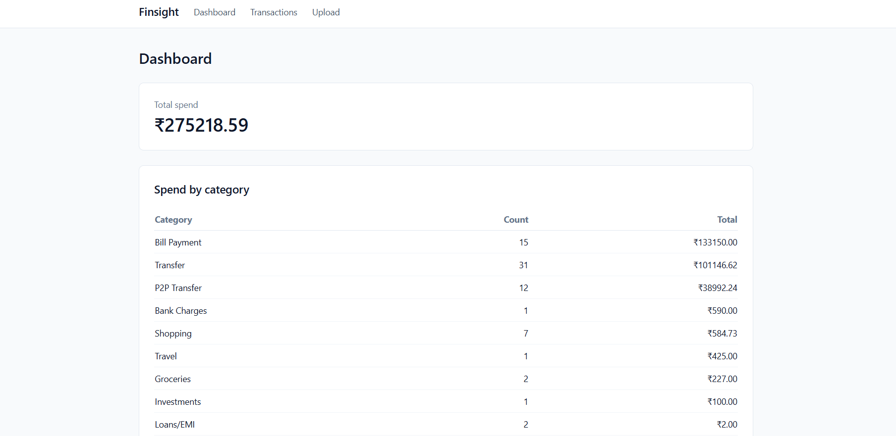
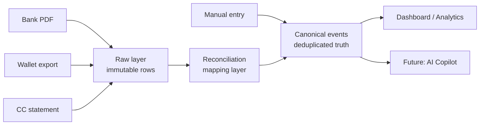

# Finsight

> Personal financial intelligence platform that ingests bank statements and reconciles transactions across sources into a single canonical ledger.

**Live demo:** [finsight-production-db99.up.railway.app](https://finsight-production-db99.up.railway.app/)
**Repo:** [github.com/Loki1928/Finsight](https://github.com/Loki1928/Finsight)



---

## What Finsight does today

- Parses real HDFC bank statement PDFs (password-protected supported) into structured rows.
- Verifies parser correctness to the paisa against the bank's own statement summary.
- Materializes a canonical event for every transaction via a 3-layer pipeline (raw → reconciliation → canonical).
- Categorizes transactions using a merchant-normalization pipeline with editable rules.
- Lets users add, edit, and delete manual transactions (cash spends, wallet contributions, cashback applications) that don't come from a parsed statement — with free-text categories that can be picked from a built-in list or invented on the spot.
- Surfaces total spend, total income, spend-by-category, and income-by-category breakdowns on the dashboard, plus a verification view of every parsed row.

V1 was tested on a real HDFC April 2026 statement: 97 rows, 73 debits, 24 credits, totals matching the bank summary exactly (₹2,75,218.59 debit / ₹2,82,778.00 credit / net +₹7,559.41).

---

## Why the 3-layer architecture

Personal finance data in India lives across at least 5 sources for most people: bank statements, credit card statements, UPI apps (GPay/PhonePe), wallets (Paytm/MobiKwik), and cash. The same real-world payment frequently shows up in multiple sources at once — and naive aggregation double-counts it.

A real example from the test data:

- A friend sends ₹500 via UPI → arrives in HDFC as a credit.
- The user pays ₹500 to someone else through MobiKwik. MobiKwik has ₹2 of accumulated cashback in the wallet, so it pulls ₹498 from HDFC and tops up ₹2 from the wallet.
- HDFC's statement shows one ₹498 debit. MobiKwik's statement shows one ₹500 send.
- Naive aggregation: ₹998 of outflow. Reality: ₹500.

The architecture is built to solve this:



**Raw layer** — every parsed row is preserved verbatim. Never edited, never deleted. Re-running reconciliation logic never destroys source data.

**Reconciliation mapping layer** — connects raw rows that represent the same real-world event. One canonical event can have many raw rows. One raw row maps to exactly one canonical event.

**Canonical layer** — the deduplicated, authoritative view. All analytics, dashboards, and future AI queries read from here. Carries a `confidence_score`, `reconciliation_level`, and `reconciliation_evidence` JSON so every merge is auditable.

The schema was designed up front to support reconciliation. The current build ingests one parsed source (HDFC) so reconciliation runs as a 1:1 pass, but adding wallet parsers later will exercise the engine without rewriting the canonical layer.

---

## Manual transactions: the missing-source escape hatch

Reconciliation only works on what's been parsed. Cash transactions, wallet cashback applications, and any merchant that doesn't issue a statement (gifts, side income, informal lending) will never appear in a parsed source — yet they affect totals.

Manual entries solve this without compromising the architecture:

- They write directly to `canonical_events` with `is_user_edited = 1`, no `upload_id`, no linked raw row. The schema was designed for this — `is_user_edited` and a nullable `raw_row` link are exactly the seams that let manual entries coexist with parsed ones.
- Users can pick from a built-in category list or type their own (e.g. "Pet supplies", "School fees"). Input is whitespace-stripped and canonical-cased on save, so "food", "Food", and " FOOD " all collapse to "Food", while "Bill Payment (CRED)" keeps its capitalization.
- The transactions list shows a small `manual` badge on user-entered rows, with Edit and Delete affordances that only appear on those rows. Parsed events are read-only via the UI — editing them would orphan their linked raw rows, which is a separate design problem deferred to a later phase.

This is also how the MobiKwik ₹2 wallet-cashback case from the example above gets reconciled honestly today: the user logs the ₹2 as a manual Cash-account credit, and the total spend number stays correct even without the MobiKwik parser yet.

---

## Another design decision: credit card bill payments

When a user pays their CRED bill (e.g. ₹40,000 to settle a credit card outstanding), naive aggregation counts it twice: once as a ₹40,000 bank debit *and* again as the sum of all the underlying card transactions that month. That inflates spend by 100%.

The canonical event schema carries an `is_liability_payment` flag. CRED-style settlement events get tagged and excluded from spend totals — only the underlying card transactions count as real spend. The current build categorizes these as `Bill Payment (CRED)` so they show in lists; the exclusion logic ships next along with a user-confirmation UX.

---

## Tech stack

| Layer | Choice | Why |
|---|---|---|
| Backend | FastAPI (Python 3.12) | Async, auto OpenAPI docs, Pydantic validation. |
| Database | SQLite + SQLAlchemy 2.x | Single-file, local-first, fast enough for personal finance. WAL mode enabled. |
| Frontend | Server-rendered Jinja2 + Tailwind CDN | No build step, no Node toolchain. Ships fast, stays maintainable. |
| PDF parsing | pdfplumber + pikepdf | Text extraction for narration-heavy bank PDFs; pikepdf handles password-protected files. |
| Fuzzy matching | rapidfuzz | Used for merchant normalization; will power Level 2/3 reconciliation in a later phase. |
| Deployment | Docker on Railway | One Dockerfile, auto-deploy on push to main. |

---

## Architecture highlights

- **Parser correctness gate**: the HDFC parser must reconcile to the statement summary within 1 paisa or the upload fails verification.
- **Page-boundary handling**: HDFC PDFs leak page-footer text into transaction narrations across page boundaries. The parser uses a `STOP_KEYWORDS` list and a footer-zone flag reset at the top of each page.
- **Merchant normalization**: regex-based pattern matching against a curated table reduces the long tail of UPI narration strings (`UPI-PRAMODAR SHRIYAN-SHRIYAN10@IBL-SBIN0000945-...`) into a clean merchant name for categorization and future reconciliation.
- **Immutable raw layer**: `raw_transactions` rows are never mutated. Reconciliation logic can be re-run from scratch without re-uploading any statements.
- **First-class manual entries**: user-added rows live in `canonical_events` alongside parsed ones, distinguished only by an `is_user_edited` flag. Same downstream queries, same indexes, same aggregation paths.

---

## Routes

| Method | Path | Purpose |
|---|---|---|
| GET | `/` | Dashboard: total spend, total income, breakdowns. |
| GET | `/transactions` | All canonical events, chronological, with summary card. |
| GET | `/transactions/add` | Manual entry form. |
| POST | `/transactions/add` | Persist a new manual transaction. |
| GET | `/transactions/{id}/edit` | Edit form (user-edited rows only; 403 on parsed rows). |
| POST | `/transactions/{id}/edit` | Update a user-edited transaction. |
| POST | `/transactions/{id}/delete` | Delete a user-edited transaction. |
| GET | `/upload` | Statement upload form. |
| POST | `/upload` | Parse + ingest + materialize a bank statement. |
| GET | `/health` | Liveness check. |

---

## What's shipped vs what's next

Shipped:

- HDFC bank statement PDF parser with password support
- Raw → canonical materialization (1:1 pass)
- Merchant normalization + rule-based categorization
- Manual transaction entry, edit, and delete with custom categories
- Dashboard (total spend, total income, both breakdowns)
- Verification view + transactions list with `manual` badges
- Live deployment on Railway

Designed-for, in progress:

- Google Sign-In via OAuth + multi-user data isolation
- Railway persistent volume (so the live URL stops wiping on redeploy)
- In-app feedback form, privacy page, delete-account flow
- Light UI cleanup pass
- MobiKwik wallet parser
- Level 1 reconciliation (exact reference-ID match across sources)
- `is_liability_payment` flag enforcement on dashboard totals

Further out:

- Additional bank parsers (SBI, ICICI, Kotak, Axis, IDFC, AU)
- Additional wallet parsers (GPay, PhonePe, Amazon Pay)
- AI copilot (function-calling architecture, narrate-only)
- Goal tracker, budget engine, recurring transaction detection
- Manual investment tracking + full net worth calculation

---

## Local development

```bash
# Clone
git clone https://github.com/Loki1928/Finsight.git
cd Finsight

# Python 3.12+
pip install -r requirements.txt

# Run
uvicorn app.main:app --reload --host 0.0.0.0 --port 8000
```

App is live on `http://localhost:8000`. The SQLite database is created automatically on first startup. Two accounts (HDFC Savings and Cash) are created on first run so you can start entering transactions immediately.

---

## Privacy

- The live demo URL currently has **no persistent storage** by design. The database wipes on every redeploy. The live URL is for evaluation only, not for real ongoing finance tracking. This changes when the Railway volume lands.
- PDF passwords are sent once with the upload, used to decrypt in-memory, and never logged or persisted.
- The repo never contains real statement files. Test fixtures live outside the repo.

---

## License

Finsight is source-available, not open source. It is licensed under the PolyForm Noncommercial License 1.0.0. You're welcome to read, run, and learn from the code for any noncommercial purpose. Commercial use — including shipping it (or a derivative) as a product or service — is not permitted without a separate license. For commercial licensing, contact the author.
